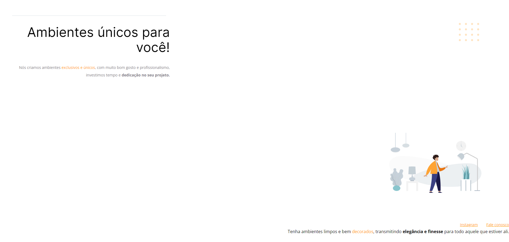

<p align="center">
	
	
	
<p>

<h1>🖥️ Preview</h1>

<p>
  	
</p>

---

<h1>📕 Sobre o desafio</h1>
<p>
Este foi um desafio desenvolvido durante o stage 02 do explorer.

Neste desafio foi entregue o código do projeto 01 que foi desenvolvido durante as aulas da fase 1 do stage 02, porem o código sofreu algumas alterações, minha missão foi corrigir os bugs apresentados na imagem acima e devolver o layout a sua forma original.

</p>

<h1>💡 Código do desafio</h1>
<p>
Abaixo você terá o código <s>(quebrado)</s> do desafio zipado.

<details>
<summary>Código do Desafio</summary>

<p>index.html</p>

```html
<!-- Instrução que define o tipo do documento. -->
<!DOCTYPE html>
<html lang="pt-br">
  <!-- Tag <head> contém as instruções para a página -->
  <head>
    <link rel="preconnect" href="https://fonts.googleapis.com" />
    <link rel="preconnect" href="https://fonts.gstatic.com" crossorigin />
    <meta charset="UTF-8" />
    <meta name="viewport" content="width=device-width, initial-scale=1.0" />
    <title>Móveis customizados</title>

    <link
      href="https://fonts.googleapis.com/css2?family=Inter:wght@400;700&family=Open+Sans:wght@400;700&display=swap"
      rel="stylesheet"
    />

    <link rel="stylesheet" href="style.css" />
  </head>

  <!-- Tag <body> é o corpo do documento, onde tem as informações que serão mostradas. -->
  <body>
    <div id="hero">
      <div class="line"></div>
      <h1>Ambientes únicos para você!</h1>
      <p>
        Nós criamos ambientes <span>exclusivos e únicos</span>, com muito
        bom gosto e profissionalismo, investimos tempo e
        <strong>dedicação no seu projeto.</strong>

        <br />
        <br />
      </p>
    </div>
    

    <div id="footer">
      <a target="_blank" href="https://instagram.com/moveisparavoce"
        >Instagram</a
      >
      <a href="mailto:contato@moveisparavoce.com">Fale conosco</a>
    </div>

    Tenha ambientes limpos e bem <span>decorados</span>, transmitindo
    <strong>elegância e finesse</strong>
    para todo aquele que estiver ali.

    
  </body>
</html>
```

<p>style.css</p>

```css
body {
  font-family: "Open Sans", sans-serif;
  text-align: end;
  margin: 0;
}

#hero {
    width: 592px;
    margin: 72px;
}

img {
    margin: 100px;
}

h1 {
  font-family: "Inter", sans-serif;
  font-size: 49px;
  line-height: 56px;
  font-weight: normal;
}

h1 span {
  font-weight: bold;

  margin-bottom: 32px;
}

span, a {
  color: #ff9900;
}

p, #footer {
  color: #7d7987;
  font-size: 14px;
  line-height: 28px;
}

#footer a + a {
    margin-left: 28px;
}

.line {
    width: 568px;
    height: 0;

    margin: 0 8px;

    border: 1px solid #ECEFF2;
}

#balls {
    position: fixed;
    top: 0;
    right: 0;
}
```

</details>
</p>

---

<h1>🚀 Tecnologias</h1>

<p>
Aplicação desenvolvida usando as seguintes tecnologias:
</p>

<ul>
  <li>HTML</li>
  <li>CSS</li>
</ul>

---

<h1>✨ Compreendido</h1>

<ul>
  <li>Ferramentas dev do navegador</li>
  <li>Interpretação de layouts (Figma)</li>
  <li>Reforçado os conceitos de refatoração e melhoria</li>
  <li>Reforçado todos os conceitos estudados no projeto 01</li>
</ul>

---

<h1>🔓 Licença</h1>
<p>
Este projeto está sob licença MIT.  <a href="./.github/LICENSE">Clique aqui</a> para mais detalhes.
</p>
