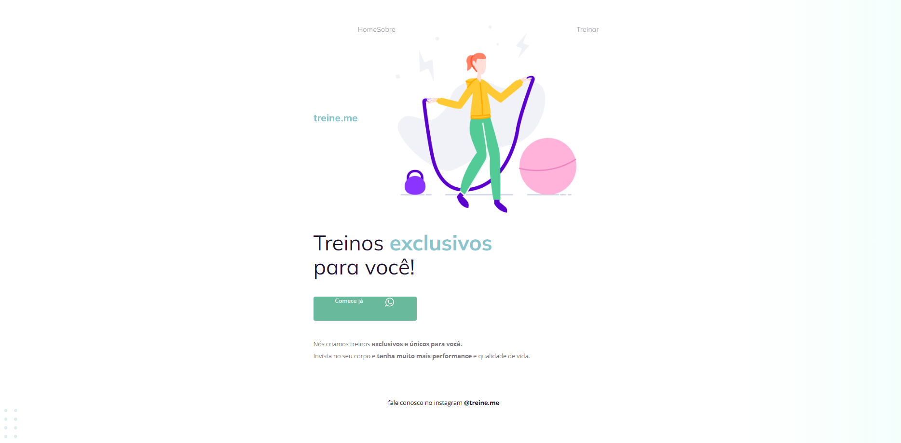

<p align="center">
	
	
	
<p>

<h1>🖥️ Preview</h1>

<p>
  	
</p>

---

<h1>📕 Sobre o desafio</h1>
<p>
Este foi um desafio desenvolvido durante o stage 02 do explorer.

Neste desafio foi entregue o código do projeto 02 que foi desenvolvido durante as aulas da fase 2  do stage 02, porem o código sofreu algumas alterações, minha missão foi corrigir os bugs apresentados na imagem acima e devolver o layout a sua forma original.

</p>

<h1>💡 Código do desafio</h1>
<p>
Abaixo você terá o código <s>(quebrado)</s> do desafio zipado.

<details>
<summary>Código do Desafio</summary>

<p>index.html</p>

```html
<!DOCTYPE html>
<html lang="pt-br">
  <head>
    <link rel="preconnect" href="https://fonts.googleapis.com">
    <link rel="preconnect" href="https://fonts.gstatic.com" crossorigin>

    <meta charset="UTF-8" />
    <meta name="viewport" content="width=device-width, initial-scale=1.0" />
    <title>Treine me</title>

    <link href="https://fonts.googleapis.com/css2?family=Mulish:wght@400;700&family=Open+Sans:wght@400;700&display=swap" rel="stylesheet">

    <link rel="stylesheet" href="style.css">

  </head>
  <body>
    <div class="page">
      <nav>
          <a id="logo" href="#">
            
          </a>
          <ul>
            <li><a href="#">Home</a></li>
            <li><a href="#">Sobre</a></li>
            
            <li><a href="#">Treinar</a></li>
          </ul>
      </nav>
      
      <main>
          <section>
            <h1>Treinos <span>exclusivos</span> para você!</h1>
            <button>
              Comece já
              
                
            </button>

            <p>
              Nós criamos treinos <strong>exclusivos e únicos para você.</strong></br>
              Invista no seu corpo e <strong>tenha muito mais performance</strong> e qualidade de vida.
            </p>

          </section>

      </main>

      <footer>
          fale conosco no instagram <a href="https://instagram.com/treineme" target="_blank">@treine.me</a>
      </footer>
    </div>

    

  </body>
</html>
```

<p>style.css</p>

```css
body {
    margin: 0;
  
    font-family: "Open Sans", sans-serif;
  
    background: linear-gradient(90deg, rgb(227, 255, 248, 0) 82.08%, rgb(227, 255, 248, 0.38) 100%);
  
    min-height: 100vh;
  }
  
  .page {
    width: 600px;
    margin: 0 auto;
    padding-top: 65px;
  }
  
  nav {
    display: flex;
    justify-content: start;
    align-items: center;
  
    margin-bottom: 15px;
  }
  
  ul {
    display: flex;
    list-style: none;
    margin: 0;
    padding: 0;
  }
  
  a {
    color: #1f1534;
    text-decoration: none;
  }
  
  ul li a {
      opacity: 0.5;
  }
  
  ul li a:hover {
    font-weight: bold;
    opacity: 1;
  }
  
  h1,
  ul {
    font-family: "Mulish", sans-serif;
  }
  
  h1 {
    font-size: 49px;
    line-height: 56px;
    color: #1f1534;
  
    font-weight: normal;
  
    width: 490px;
  }
  
  h1 span {
    color: #89c5cc;
    font-weight: bold;
  }
  
  section p {
    font-size: 14px;
    line-height: 28px;
    color: #7d7987;
  
    margin: 40px 0;
  }
  
  button {
    color: white;
    font-family: "Open Sans", sans-serif;
  
    background: #69B99D;
    border: 0;
    padding: 0 50px 30px;
  
    display: flex;
    justify-content: space-around;
    gap: 50px;
  
    border-radius: 4px;
  
    cursor: pointer;
  }
  
  button:hover {
      background: #4EA788;
  }
  
  footer {
    font-size: 14px;
    line-height: 28px;
  
    text-align: center;
  
    margin-top: 80px;
  }
  
  footer a {
    font-weight: bold;
  }
  
  #balls {
      bottom: 0;
      right: 0;
  }
```

</details>
</p>

---

<h1>🚀 Tecnologias</h1>

<p>
Aplicação desenvolvida usando as seguintes tecnologias:
</p>

<ul>
  <li>HTML</li>
  <li>CSS</li>
</ul>

---

<h1>✨ Compreendido</h1>

<ul>
  <li>Ferramentas dev do navegador</li>
  <li>Interpretação de layouts (Figma)</li>
  <li>Reforçado os conceitos de refatoração e melhoria</li>
  <li>Reforçado todos os conceitos estudados no projeto 02</li>
</ul>

---

<h1>🔓 Licença</h1>
<p>
Este projeto está sob licença MIT.  <a href="./.github/LICENSE">Clique aqui</a> para mais detalhes.
</p>
