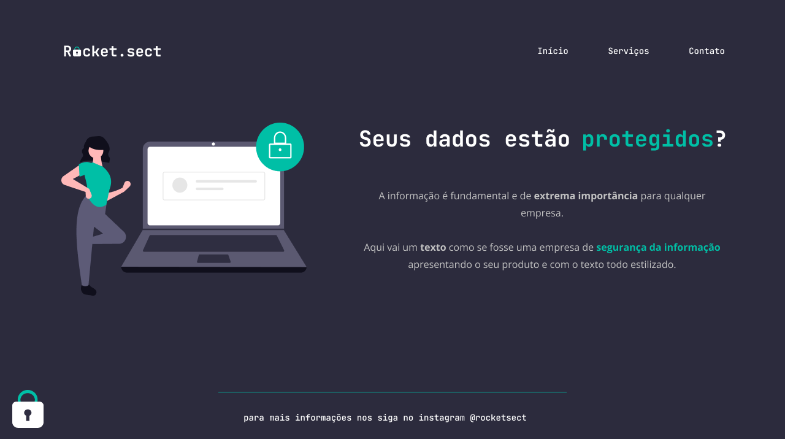

	
	
	

<h1>🖥️ Preview</h1>

  	

---

<h1>📕 Sobre o desafio</h1>

Este foi um desafio desenvolvido durante o stage 02 do explorer.

Neste desafio, tive que recriar uma aplicação chamada de Rocket.sect, a partir de um layout estático, para treinar o que aprendi até agora no <strong>Stage 02</strong>.

---

<h1>🚀 Tecnologias</h1>

Aplicação desenvolvida usando as seguintes tecnologias:

<ul>
  <li>HTML</li>
  <li>CSS</li>
</ul>

---

<h1>✨ Compreendido</h1>

<ul>
  <li>Ferramentas dev do navegador</li>
  <li>Interpretação de layouts (Figma)</li>
  <li>Reforçado todos os Fundamentos do HTML e CSS</li>
  <li>Autonomia ao deselvolver o projeto</li>
  <li>Utilizar conceitos de Flex box, alinhamento e formatação dos textos entre outros...</li>
</ul>

---

<h1>🔓 Licença</h1>

Este projeto está sob licença MIT.  <a href="./.github/LICENSE">Clique aqui</a> para mais detalhes.

