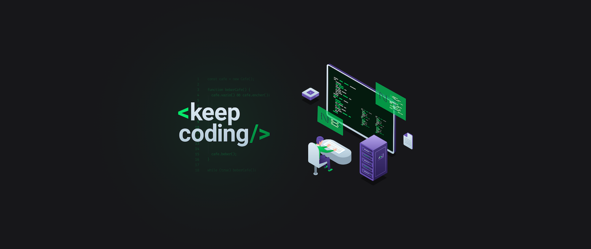

	
	
	

  	

<h1>📕 Sobre</h1>

O Explorer é um programa de 6 meses desenmvolvido pela equipe da  <a href="https://www.instagram.com/rocketseat_oficial/">rocketseat</a> que vai te ensinar a se posicionar como um profissional de programação e acessar a sua primeira oportunidade no mercado.
O Explorer foi criado com um método inteligente e eficiente para te ajudar a evoluir habilidades técnicas e comportamentais específicas que farão de você um profissional pronto para lidar com desafios do mundo real.

<h3> Como faremos isso ?</h3> 

<blockquote>
Nós trabalharemos juntos.
Desde os fundamentos até as principais ferramentas que você precisa para acessar a sua primeira oportunidade utilizando o método 7-2-1. Ou seja, você vai dominar coding, networking e branding.
Isso significa que você vai se preparar e se sentir seguro(a) para assumir desafios do mundo real.
Desenvolver cada um desses aspectos te fará um dev muito mais qualificado para o mercado de trabalho, e isso vai aumentar tuas chances de ser sempre a primeira opção dos recrutadores.
</blockquote>

