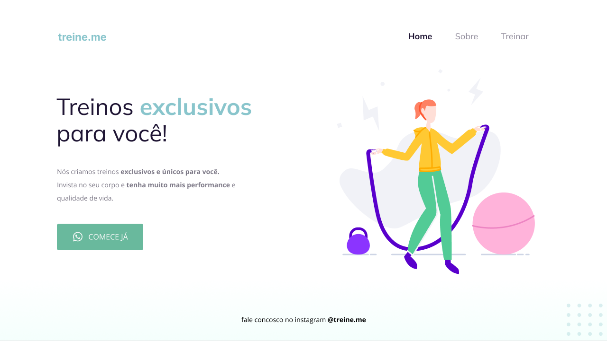

	
	
	

<h1>🖥️ Preview</h1>

  	

---

<h1>📕Sobre</h1>

Treine.me foi um projeto desenvolvido durante o stage 02 do explorer.

A ideia do projeto é imlpementar novos conceitos estudados no stage 02 e reforçar os conhecimentos de HTML e CSS. Este também é um projeto pratico que vai desde como utilizar/usufruir do figma até a aplicação de conceitos como alinhamentos, cores e fontes, espaçamentos, posicionamentos, botões, menu de navegação entre outros.

---

<h1>🚀 Tecnologias</h1>

Aplicação desenvolvida usando as seguintes tecnologias:

<ul>
  <li>HTML</li>
  <li>CSS</li>
</ul>

---

<h1>✨ Compreendido</h1>

<ul>
  <li>Ferramentas dev do navegador</li>
  <li>Interpretação de layouts (Figma)</li>
  <li>Fundamentos do HTML e CSS</li>
  <li>Tags & atributos</li>
  <li>Estruturando HTML com tags semânticas</li>
  <li>Melhoria na acessibilidade e refatoração</li>
  <li>O conceito de Flexbox do CSS</li>
  <li>O conceito Box Model do CSS</id>
</ul>

---

<h1>🔓 Licença</h1>

Este projeto está sob licença MIT.  <a href="./.github/LICENSE">Clique aqui</a> para mais detalhes.

